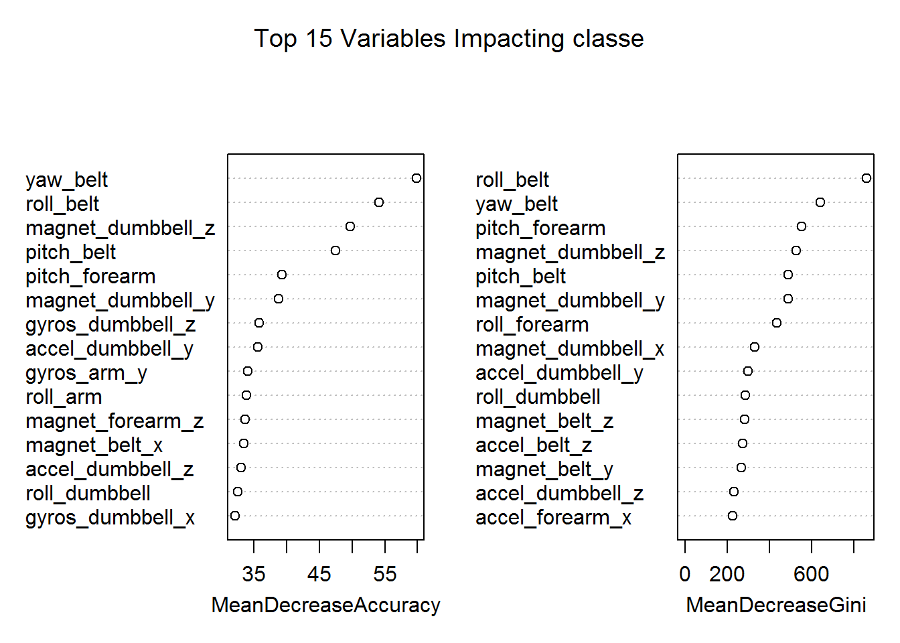

# Machine Learning
Satish Kumar Barnala  
Saturday, June 13, 2015  

Using devices such as Jawbone Up, Nike FuelBand, and Fitbit it is now possible to collect a large amount of data about personal activity relatively inexpensively. One thing that people regularly do is quantify how much of a particular activity they do, but they rarely quantify how well they do it. In this project, our goal is to use data from accelerometers on the belt, forearm, arm, and dumbell of 6 participants. They were asked to perform barbell lifts correctly and incorrectly in 5 different ways.

The goal of this machine learning exercise is to predict the manner in which the participants did the exercise-that is, to predict the "classe" variable found in the training set. The prediction model will then be used to predict twenty different test cases, as provided in the testing dataset.

The training and testing datasets used in the analysis are:

Training dataset: https://d396qusza40orc.cloudfront.net/predmachlearn/pml-training.csv

Testing dataset: https://d396qusza40orc.cloudfront.net/predmachlearn/pml-testing.csv

## Read the data

```r
library(ggplot2);library(caret); library(kernlab);library(randomForest)
```

```
## Loading required package: lattice
## randomForest 4.6-10
## Type rfNews() to see new features/changes/bug fixes.
```

```r
traindf <- read.csv("pml-training.csv", header = TRUE, na.strings = c("NA", ""))
testdf <- read.csv("pml-testing.csv", header = TRUE, na.strings = c("NA", ""))

dim(traindf)
```

```
## [1] 19622   160
```
## Remove columns havinng missing data 

- We will remove the columns that seem to be insignificant
- Remove columns having morethan 95% 'NA' or ''
- Remove columns having near zero variance


```r
traindf <- subset(traindf, select=-c(1:7))
#testdf <- subset(testdf, select=-c(1:7))

# Threshold is 95% off total rowns
thresh <- 0.95 * dim(traindf)[1]

# Remove columns that have  morethan 95% 'NA' or ''
Collogi <- !apply(traindf, 2, function(x) sum(is.na(x)) > thresh || sum(x=="") > thresh)
traindf <- traindf[, Collogi]
dim(traindf)
```

```
## [1] 19622    53
```

```r
# Remove columns having near zero variance
nzvlogi <- nearZeroVar(traindf, saveMetrics = TRUE)
traindf <- traindf[ , nzvlogi$nzv==FALSE] 
dim(traindf)
```

```
## [1] 19622    53
```
## Data Modeling
- Split the training data in to training and validate data sets
- Apply Random Forest model

```r
set.seed(98765)

indxTrain <- createDataPartition(y = traindf$classe, p = 0.7, list = FALSE)
traindf1 <- traindf[indxTrain, ]
validdf <- traindf[-indxTrain, ]

modelrf <- randomForest(classe~., data=traindf1, importance=TRUE)
```
## Cross Validation and Out-of-Sample Error Estimate


```r
validdf_pred <- predict(modelrf, newdata=validdf)
# Confusion Matrix
cfm <- confusionMatrix(validdf_pred, validdf$classe)
cfm
```

```
## Confusion Matrix and Statistics
## 
##           Reference
## Prediction    A    B    C    D    E
##          A 1670    7    0    0    0
##          B    3 1130    4    0    0
##          C    0    2 1021   11    0
##          D    0    0    1  953    6
##          E    1    0    0    0 1076
## 
## Overall Statistics
##                                           
##                Accuracy : 0.9941          
##                  95% CI : (0.9917, 0.9959)
##     No Information Rate : 0.2845          
##     P-Value [Acc > NIR] : < 2.2e-16       
##                                           
##                   Kappa : 0.9925          
##  Mcnemar's Test P-Value : NA              
## 
## Statistics by Class:
## 
##                      Class: A Class: B Class: C Class: D Class: E
## Sensitivity            0.9976   0.9921   0.9951   0.9886   0.9945
## Specificity            0.9983   0.9985   0.9973   0.9986   0.9998
## Pos Pred Value         0.9958   0.9938   0.9874   0.9927   0.9991
## Neg Pred Value         0.9990   0.9981   0.9990   0.9978   0.9988
## Prevalence             0.2845   0.1935   0.1743   0.1638   0.1839
## Detection Rate         0.2838   0.1920   0.1735   0.1619   0.1828
## Detection Prevalence   0.2850   0.1932   0.1757   0.1631   0.1830
## Balanced Accuracy      0.9980   0.9953   0.9962   0.9936   0.9971
```

- We achieved 99.41% accuracy with this model
- Out of sample error is 0.59%

## Plot the Important variables with MeanDecreaseAccuracy and MeanDecreaseGini

```r
varImpPlot(modelrf, n.var=15, main="Top 15 Variables Impacting classe")
```

 

## Applying the model on test data


```r
predict(modelrf, newdata=testdf)
```

```
##  1  2  3  4  5  6  7  8  9 10 11 12 13 14 15 16 17 18 19 20 
##  B  A  B  A  A  E  D  B  A  A  B  C  B  A  E  E  A  B  B  B 
## Levels: A B C D E
```
## End of report


